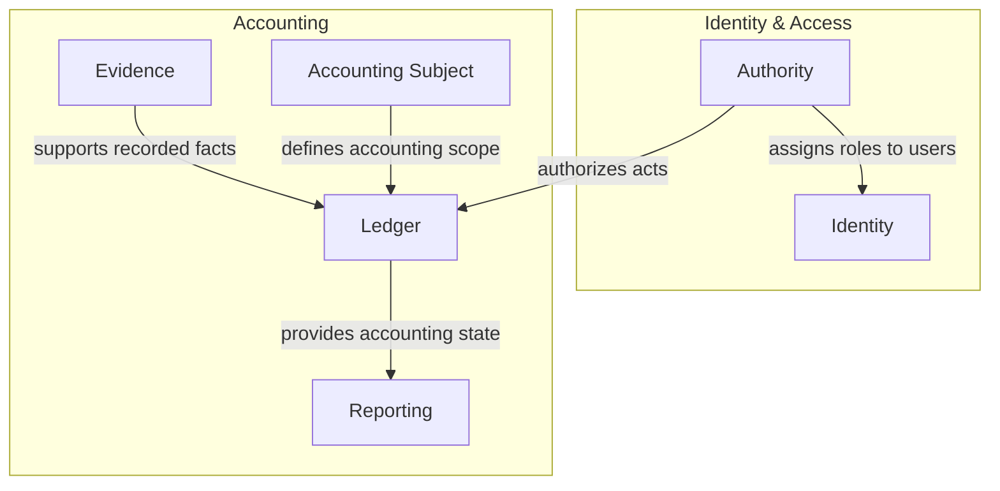

# ACC.NET

A modular accounting system built with .NET, Domain-Driven Design, CQRS and Event Sourcing.

## Status

ACC.NET is under active development.

Current focus is on implementing a minimal set of use cases for a minimum accounting application.

## Domain Model

The diagram below summarizes the current semantic model of subdomains, bounded contexts, and relationships between them.



## Architecture

ACC.NET is implemented as a modular monolith with bounded-context modules composed by `ACC.Host` and founded on `ACC.BuildingBlocks`.

## Current Capabilities

ACC.NET currently includes early support for:

- registering and authenticating users
- verifying and resending email verification
- creating accounting subjects
- assigning authority roles
- opening and closing fiscal periods
- posting and viewing journal entries

We are still in an early phase, more capabilities will be added incrementally over time.

## Repository Structure

```text
src/
├─ ACC.AccountingSubject
├─ ACC.Application
├─ ACC.Authority
├─ ACC.BuildingBlocks
├─ ACC.Evidence
├─ ACC.Host
├─ ACC.Identity
├─ ACC.Ledger
├─ ACC.Reporting
└─ ACC.VAT

tests/
├─ ACC.AccountingSubject.Tests
├─ ACC.Application.Tests
├─ ACC.Authority.Tests
├─ ACC.Evidence.Tests
├─ ACC.Identity.Tests
├─ ACC.Ledger.Tests
├─ ACC.Reporting.Tests
└─ ACC.VAT.Tests
```


## Requirements

- .NET SDK 10

## Build

```bash
dotnet build acc-dotnet.slnx
```

## Test

```bash
dotnet test acc-dotnet.slnx
```

## Run

```bash
dotnet run --project src/ACC.Host/ACC.Host.csproj
```

## License

See [LICENSE](LICENSE) for details.
