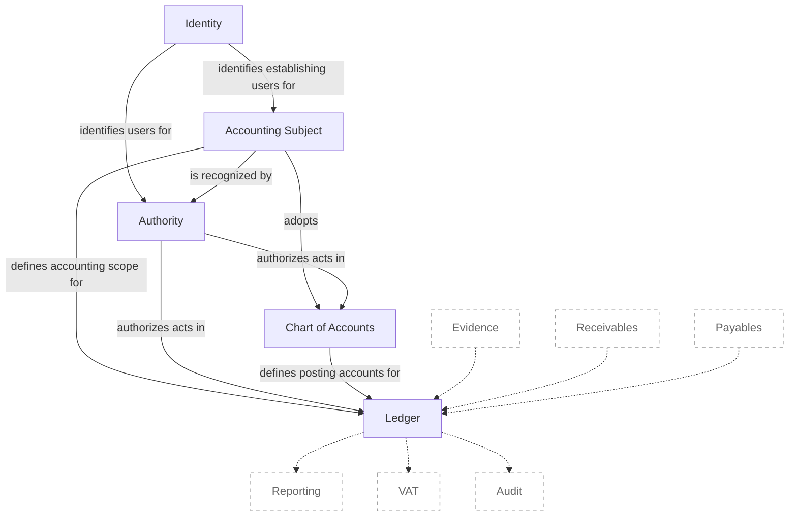

# ACC.NET

An accounting system built with C#/.NET.

## Purpose

The project exists to:

- Discover the accounting domain through institutional theory.
- Build an accounting system from that understanding.
- Develop the system into a commercially viable product.

## Status

The MVP is under active development.

## Context Map

The map shows the current bounded contexts and their principal relationships.



## Context Catalogs

- [Identity](src/ACC.Identity/README.md)
- [Authority](src/ACC.Authority/README.md)
- [Accounting Subject](src/ACC.AccountingSubject/README.md)
- [Chart of Accounts](src/ACC.ChartOfAccounts/README.md)
- [Ledger](src/ACC.Ledger/README.md)

## Architecture & Design

- Domain-Driven Design
- Hexagonal Architecture
- CQRS
- Event Sourcing
- Modular Monolith

## Roadmap

- [x] User registration, email verification, and authentication
- [x] Accounting-subject establishment and onboarding
- [x] Ownership, role assignment, and authority
- [x] Chart-of-accounts adoption and management
- [x] Fiscal-period management
- [x] Journal-entry posting and viewing
- [ ] Evidence
- [ ] Receivables
- [ ] Payables
- [ ] Reporting
- [ ] VAT
- [ ] Auditing

## Repository Structure

```text
src/
├─ ACC.AccountingSubject
├─ ACC.Application
├─ ACC.Authority
├─ ACC.BuildingBlocks
├─ ACC.ChartOfAccounts
├─ ACC.Evidence
├─ ACC.Host
├─ ACC.Identity
├─ ACC.Ledger
├─ ACC.Reporting
└─ ACC.VAT

tests/
├─ ACC.AccountingSubject.Tests
├─ ACC.Application.Tests
├─ ACC.Authority.Tests
├─ ACC.ChartOfAccounts.Tests
├─ ACC.Evidence.Tests
├─ ACC.Host.Tests
├─ ACC.Identity.Tests
├─ ACC.Ledger.Tests
├─ ACC.Reporting.Tests
├─ ACC.Testing
└─ ACC.VAT.Tests

tools/
├─ ACC.Bas.Tooling
└─ ACC.Bas.Tooling.Tests
```

## Requirements

- .NET SDK 10

## Build

```bash
dotnet build acc-dotnet.slnx
```

## Test

```bash
dotnet test acc-dotnet.slnx
```

## Run

```bash
dotnet run --project src/ACC.Host/ACC.Host.csproj
```

Explore the API documentation at [http://localhost:5055/swagger](http://localhost:5055/swagger).

## Acknowledgements

Thank you to Eric Evans and Vaughn Vernon for their foundational work on Domain-Driven Design. Their ideas strongly influence how ACC.NET approaches domain discovery, modeling, and software design.

## License

See [LICENSE](LICENSE) for details.
