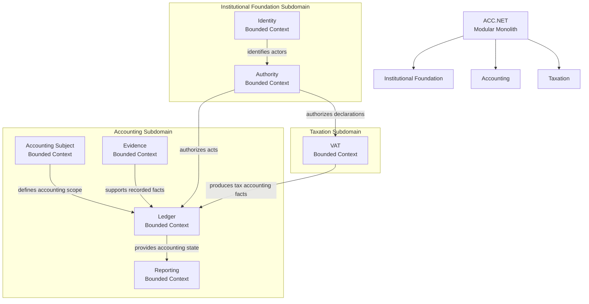

# ACC.NET

An accounting system written in .NET using Domain-Driven Design.

## Status

ACC.NET is under active development.

Current focus:

- Discover the domain.
- Set the architecture and design principles.
- Scaffold the project.
- Implement a minimal set of essential accounting use cases for an MVP.

## Domain Model

The diagram below illustrates the subdomains, bounded contexts, and relationships between them.



## Architecture

ACC.NET is implemented as a modular monolith with bounded-context modules composed by `ACC.Host` and founded on `ACC.BuildingBlocks`.

## Repository Structure

```text
src/
├─ ACC.AccountingSubject
├─ ACC.Host
├─ ACC.Ledger
├─ ACC.Identity
├─ ACC.Authority
├─ ACC.Evidence
├─ ACC.Reporting
├─ ACC.VAT
└─ ACC.BuildingBlocks

tests/
├─ ACC.Ledger.Tests
└─ ...
```

## Requirements

- .NET SDK 10

## Build

```bash
dotnet build acc-dotnet.slnx
```

## Test

```bash
dotnet test acc-dotnet.slnx
```

## Run

```bash
dotnet run --project src/ACC.Host/ACC.Host.csproj
```

## Design Philosophy

ACC.NET follows these principles:

- semantic domain discovery
- simplicity over complexity
- scaling only when needed
- full test coverage

## License

See [LICENSE](LICENSE) for details.
