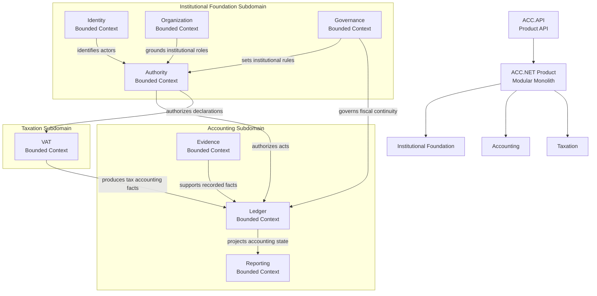

# ACC.NET

An accounting application.

Built on .NET using domain-driven design principles.

## Status

Early development.

The project is currently focused on domain discovery and implementation of the core accounting domain.

The immediate objective is to develop a minimal viable product containing a small set of essential accounting use cases.

## Goals

* Build a practical accounting application.
* Apply Domain-Driven Design principles throughout the codebase.
* Maintain a clear ubiquitous language.
* Keep the architecture aligned with the semantics of the business domain.
* Favor simplicity and evolvability over premature optimization.

## Architecture

ACC.NET is implemented as a modular monolith. Modules are logical boundaries for
language, domain model, business rules, and use cases; they are not deployment
boundaries.

The current architectural map is exploratory. It distinguishes broad subdomains
from the bounded contexts being discovered and implemented inside them.

Bounded contexts collaborate through explicit contracts and well-defined
dependencies. Deployment boundaries are intentionally deferred until justified by
business or operational needs.

## Domain-Driven Design

ACC.NET follows Domain-Driven Design (DDD) principles.

Particular emphasis is placed on:

* Strategic Design
* Bounded Contexts
* Ubiquitous Language
* Rich Domain Models
* Explicit Domain Boundaries
* Continuous Domain Discovery

The architecture is expected to evolve as domain understanding improves.

## License

See the LICENSE file for details.
