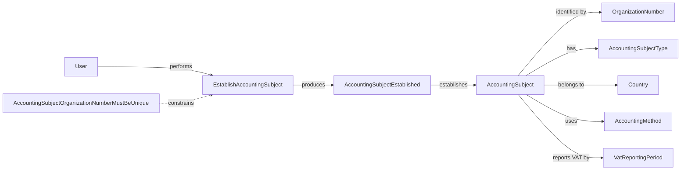

# ACC.AccountingSubject

The **Accounting Subject** context recognizes the subject for whose economic activity accounting is maintained.

An **Accounting Subject** has a name and organization number and is characterized by its type, country, accounting method, and VAT reporting period. The current model supports Swedish sole traders and is expected to develop as further institutional forms and rules are discovered.

Establishment records an accounting subject within ACC.NET. It does not constitute or legally register the person or organization represented by that subject.

## Ontology Diagram

## Aggregates

| Aggregate | Description |
| --- | --- |
| AccountingSubject | Represents the recognized subject for whose economic activity accounting is maintained. |

## Use Cases

| Use Case | Description |
| --- | --- |
| EstablishAccountingSubject | Establishes an accounting subject within ACC.NET for an already recognized user. |

## Events

| Event | Meaning |
| --- | --- |
| AccountingSubjectEstablished | An accounting subject has been recognized within ACC.NET, including who performed the establishment and when it occurred. |

## Invariants

| Invariant | Meaning |
| --- | --- |
| AccountingSubjectOrganizationNumberMustBeUnique | An organization number cannot identify more than one accounting subject in the current model. |
