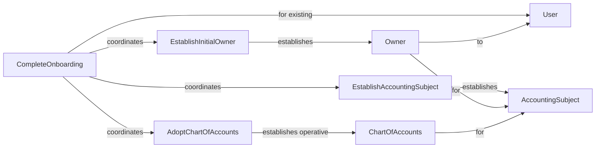

# ACC.Application

The **Application** module coordinates workflows that do not naturally belong to a single bounded context.

It does not own core domain concepts. Instead, it composes bounded-context use cases into larger application workflows.

The current application workflow lets an already registered **User** complete onboarding by establishing an **Accounting Subject** and its founding **Owner** role, then adopting a selected **Chart of Accounts** template.

## Ontology Diagram

## Aggregates

No aggregates are owned by this module.

## Use Cases

| Use Case | Description |
| --- | --- |
| CompleteOnboarding | Completes onboarding by establishing an accounting subject and its founding Owner, then adopting the selected chart-of-accounts template. |

## Events

No application events have been introduced yet.

## Invariants

No application invariants have been introduced yet.
