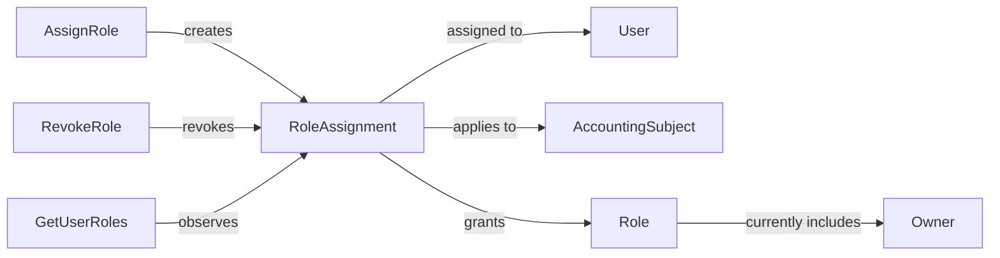

# ACC.Authority

The **Authority** context determines which **Users** may perform acts for an **Accounting Subject**.

Authority is represented through **Role Assignments**. A **Role Assignment** says that a **User** has a **Role** for a specific **Accounting Subject** during a period of time.

The current role catalog starts with **Owner**.

## Ontology Diagram

## Aggregates

| Aggregate | Description |
| --- | --- |
| RoleAssignment | Represents that a user has a role for an accounting subject during a period of time. |

## Use Cases

| Use Case | Description |
| --- | --- |
| AssignRole | Grants a role to a user for an accounting subject. |
| RevokeRole | Revokes a previously assigned role. |
| GetUserRoles | Returns the roles assigned to a user. |

## Events

No authority events have been introduced yet.

## Invariants

No authority invariants have been introduced yet.
