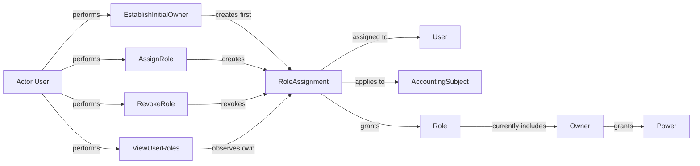

# ACC.Authority

The **Authority** context determines which **Users** may perform acts for an **Accounting Subject**.

Authority is represented through **Role Assignments**. A **Role Assignment** says that a **User** has a **Role** for a specific **Accounting Subject** during a period of time.

The current role catalog starts with **Owner**.

Roles grant **Powers**. A **Power** is the recognized capacity to perform an institutional act for an accounting subject.

## Ontology Diagram

## Aggregates

| Aggregate | Description |
| --- | --- |
| RoleAssignment | Represents that a user has a role for an accounting subject during a period of time. |

## Use Cases

| Use Case | Description |
| --- | --- |
| EstablishInitialOwner | Establishes the founding Owner role for a newly created accounting subject. |
| AssignRole | Grants a role to a user for an accounting subject by an acting user. |
| RevokeRole | Revokes a previously assigned role by an acting user. |
| ViewUserRoles | Shows an authenticated user their own active role assignments across accounting subjects. |

## Powers

| Power | Description |
| --- | --- |
| AssignRole | The capacity to grant a role for an accounting subject. |
| RevokeRole | The capacity to end a role assignment for an accounting subject. |
| AdoptChartOfAccounts | The capacity to establish an operative chart of accounts for an accounting subject. |
| ManageChartOfAccounts | The capacity to add, deactivate, and reactivate accounts in an operative chart. |
| ViewChartOfAccounts | The capacity to view the operative chart belonging to an accounting subject. |
| PostJournalEntry | The capacity to record a journal entry in the ledger. |
| ViewJournalEntry | The capacity to view a journal entry belonging to an accounting subject. |
| OpenFiscalPeriod | The capacity to open a fiscal period for posting. |
| CloseFiscalPeriod | The capacity to close a fiscal period for posting. |

## Events

| Event | Description |
| --- | --- |
| RoleAssigned | Records that a user has been recognized as holding a role for an accounting subject, including who performed the assignment. |
| RoleRevoked | Records that a previously recognized role assignment has ended, including who performed the revocation. |

## Invariants

| Invariant | Description |
| --- | --- |
| UserMustBeRecognizedForAuthority | A user must be recognized before authority can be assigned or used to revoke authority. |
| AccountingSubjectMustBeRecognizedForAuthority | An accounting subject must be recognized before authority can be assigned for it. |
| ActorMustHavePower | An acting user must hold a role that grants the power required by the authority act. |
| ActiveRoleAssignmentMustBeUnique | A user cannot hold the same active role more than once for the same accounting subject. |
| RoleAssignmentMustBeActiveToRevoke | A role assignment must still be active before it can be revoked. |
