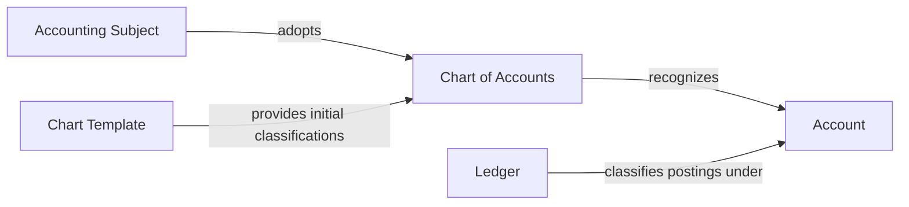

# ACC.ChartOfAccounts

The **Chart of Accounts** context defines the accounts through which an **Accounting Subject** classifies economic events in the **Ledger**.

An **Account** is a recognized classification within an adopted **Chart of Accounts**. Adoption creates an operative chart from a selected template, after which the accounting subject may add or change the availability of local accounts without altering historical classifications.

## Ontology Diagram

## Aggregates

| Aggregate | Description |
| --- | --- |
| ChartOfAccounts | The operative classification structure adopted by an accounting subject. It owns the identity and availability of its accounts. |

## Use Cases

| Use Case | Description |
| --- | --- |
| AdoptChartOfAccounts | Creates an operative chart for an accounting subject from a selected template. |
| AddAccount | Introduces a locally defined account without reassigning an existing account number. |
| DeactivateAccount | Ends an account's availability for future posting while preserving its identity and history. |
| ReactivateAccount | Restores a previously deactivated account's availability for future posting. |
| ViewChartOfAccountsTemplates | Shows the chart-of-accounts templates currently available for adoption. |
| ViewChartOfAccounts | Shows the adopted chart and its current account classifications. |

## Events

| Event | Description |
| --- | --- |
| ChartOfAccountsAdopted | Records the selected template and complete account snapshot adopted by an accounting subject. |
| AccountAdded | Records recognition of a locally defined account. |
| AccountDeactivated | Records that an account is no longer available for future posting. |
| AccountReactivated | Records that an account is available for posting again. |

## Invariants

| Invariant | Description |
| --- | --- |
| AccountingSubjectMustHaveAtMostOneOperativeChartOfAccounts | An accounting subject cannot use competing operative general-ledger charts at the same time. |
| AccountNumberMustBeUniqueWithinChartOfAccounts | An account number identifies no more than one classification within a chart, including inactive accounts. |
| ActorMustHaveChartOfAccountsPower | Adoption and modification are valid only when performed by an actor with the required institutional power. |

## Templates

The module offers concrete chart templates derived from BAS publications. A template has a stable identity, a name, and resolved accounts. Further concepts will be introduced when their meaning and use are better understood.

The repository currently contains:

| Template ID | Name | Accounts |
| --- | --- | --- |
| `se:bas:k1:2018` | BAS 2018 för K1 | 151 |
| `se:bas:k1-mini:2018` | BAS 2018 för K1 Mini | 39 |

Only generated `.template.json` resources are stored under `Infrastructure/Resources/Templates` and copied into the deployed module. BAS publications, parsing, and generation recipes belong to `ACC.Bas.Tooling`; they are not runtime concerns of this bounded context.
