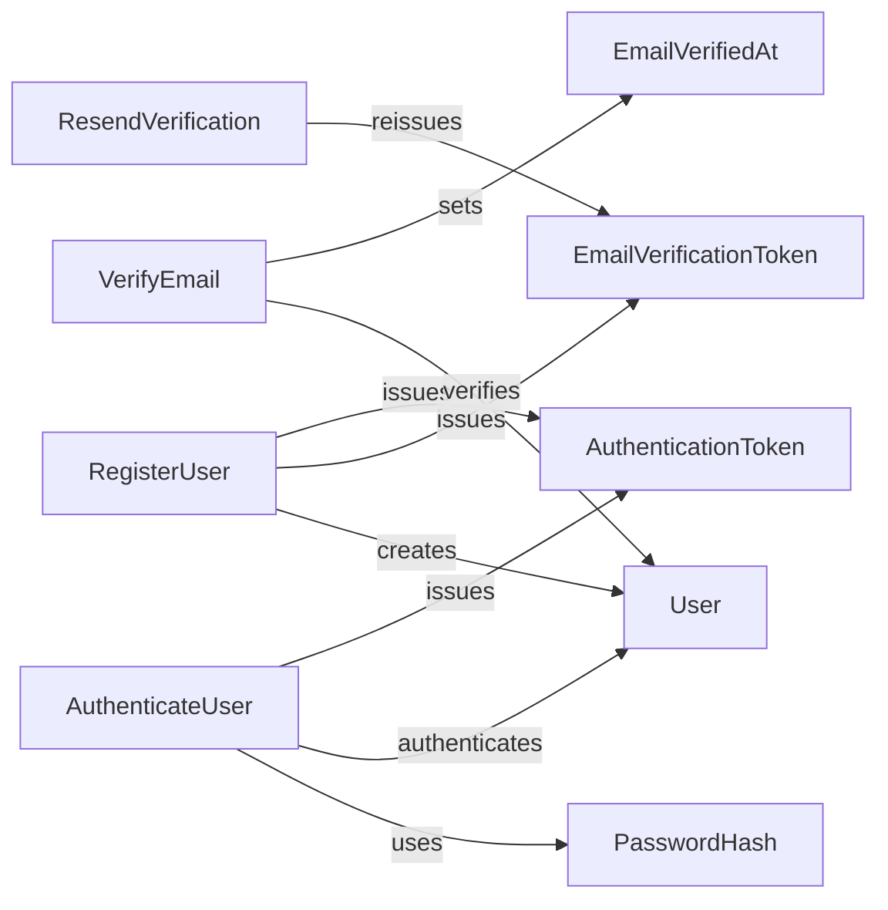

# ACC.Identity

The **Identity** context manages **Users** who can authenticate with ACC.NET.

A **User** represents an actor with an email address, password credential, activation state, and **email verification** state.

**Authentication** establishes that the actor controls the registered credential.

Email verification establishes that the actor controls the registered email address.

Verified email ownership supports authority, onboarding, and access to workflows that require confirmed email ownership.

## Ontology Diagram

## Aggregates

| Aggregate | Description |
| --- | --- |
| User | Represents an actor who can authenticate and participate in the system. |

## Use Cases

| Use Case | Description |
| --- | --- |
| RegisterUser | Registers a user identity, starts email verification, and issues an authentication token. |
| VerifyEmail | Confirms that a user controls the registered email address. |
| ResendVerification | Issues a new email verification token for an unverified user. |
| AuthenticateUser | Authenticates a user using their email and password credential and issues an authentication token. |

## Events

| Event | Meaning |
| --- | --- |
| EmailVerificationResent | A new email verification token has been issued for an unverified user. |
| EmailVerified | A user email address has been verified. |
| UserRegistered | A user identity has been registered and email verification has started. |

## Invariants

| Invariant | Meaning |
| --- | --- |
| AuthenticationMustBeValid | Authentication may only complete when the supplied credentials are valid. |
| EmailMustNotAlreadyBeVerified | Acts that require an unverified email address cannot be performed after the email address has been verified. |
| EmailVerificationMustBeValid | Email verification may only complete when the verification attempt is valid. |
| UserMustBeActiveToAuthenticate | Only active users may authenticate. |
| UserEmailMustBeValid | A user must be registered with a valid email address. |
| UserEmailMustBeUnique | A user cannot be registered with an email address that is already assigned to another user. |
