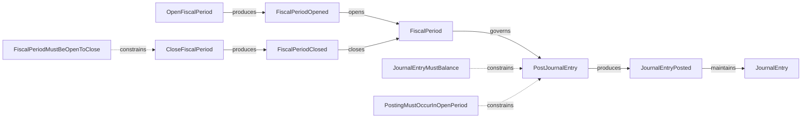

# ACC.Ledger

The **Ledger** records accounting facts for an **Accounting Subject** within **Fiscal Periods**.

Accounting facts are recorded through the posting of **Journal Entries**. The Ledger preserves accounting validity by enforcing accounting invariants and maintaining admissible accounting history over time.

The resulting ledger facts provide the foundation for reporting, taxation, and accounting decisions.

## Ontology Diagram

## Aggregates

| Aggregate    | Description                                                                    |
| ------------ | ------------------------------------------------------------------------------ |
| JournalEntry | Represents an accounting record consisting of one or more journal entry lines. |
| FiscalPeriod | Governs whether accounting facts may be recorded for a period of time.         |

## Use Cases

| Use Case         | Description                                                                                                |
| ---------------- | ---------------------------------------------------------------------------------------------------------- |
| OpenFiscalPeriod | Opens a fiscal period for an accounting subject.                                                           |
| CloseFiscalPeriod | Closes an open fiscal period.                                                                             |
| PostJournalEntry | Records an accounting fact in the ledger by posting a balanced journal entry within an open fiscal period. |
| ViewJournalEntry | Returns a representation of a previously recorded journal entry.                                           |

## Events

| Event              | Meaning                                          |
| ------------------ | ------------------------------------------------ |
| FiscalPeriodOpened | A fiscal period has been opened for posting.     |
| FiscalPeriodClosed | A fiscal period has been closed for posting.     |
| JournalEntryPosted | A journal entry has been recorded in the ledger. |

## Invariants

The Ledger protects accounting validity through domain invariants.

| Invariant                    | Meaning                                                      |
| ---------------------------- | ------------------------------------------------------------ |
| JournalEntryMustBalance      | Total debits must equal total credits.                       |
| PostingMustOccurInOpenPeriod | Journal entries may only be posted in an open fiscal period. |
| FiscalPeriodMustBeOpenToClose | A fiscal period may only be closed if it is open.            |
